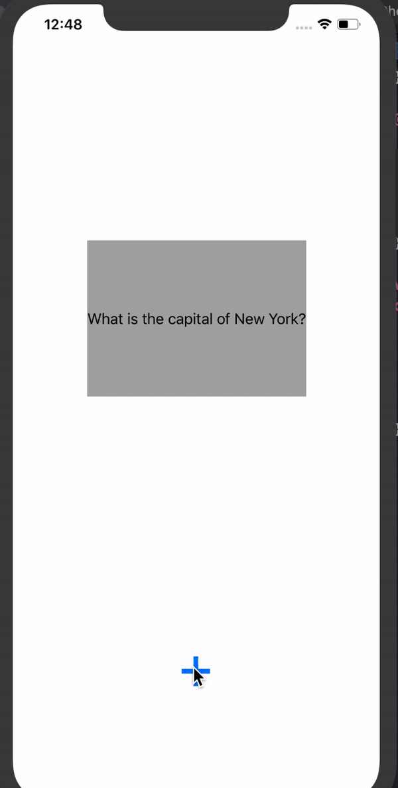

## Lab 3

### App Description
 Completed all of the required steps for the third lab.

### App Walk-though

## Required
- [x] User can browse through multiple flashcards
- [x] User can re-open the app and see previously created flashcards
- [x] Push code to GitHub
## Optional
- [ ] User can delete a flashcard
- [ ] User can edit existing flashcard
- [ ] User can store multiple choice questions

## Lab 2

### App Description
 Completed all of the required steps for the second lab.

### App Walk-though

 

## Required
- [x] User can open the creation screen
- [x] User can cancel out of the creation screen
- [x] User can enter a new question and answer in the creation screen to then show it on the flashcard
- [x] Push code to GitHub
## Optional
- [ ] User gets an error if they try to create a new flashcard with no question or answer
- [ ] User can edit existing flashcard
- [ ] User can add multiple choice answers in the creation screen
